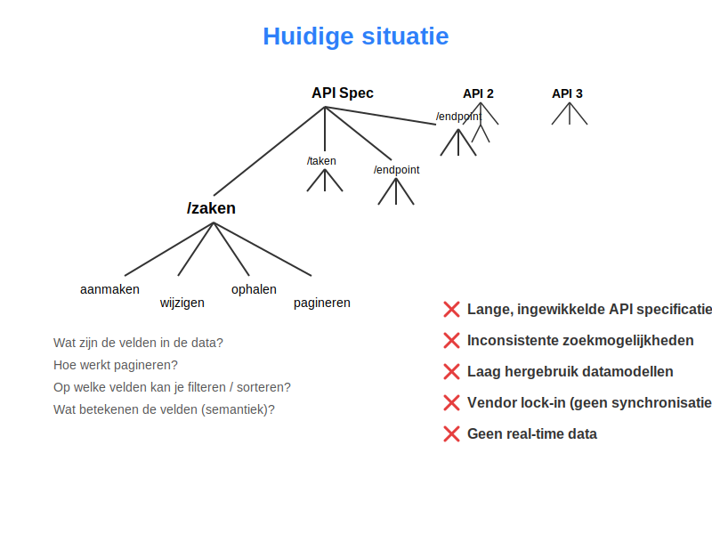
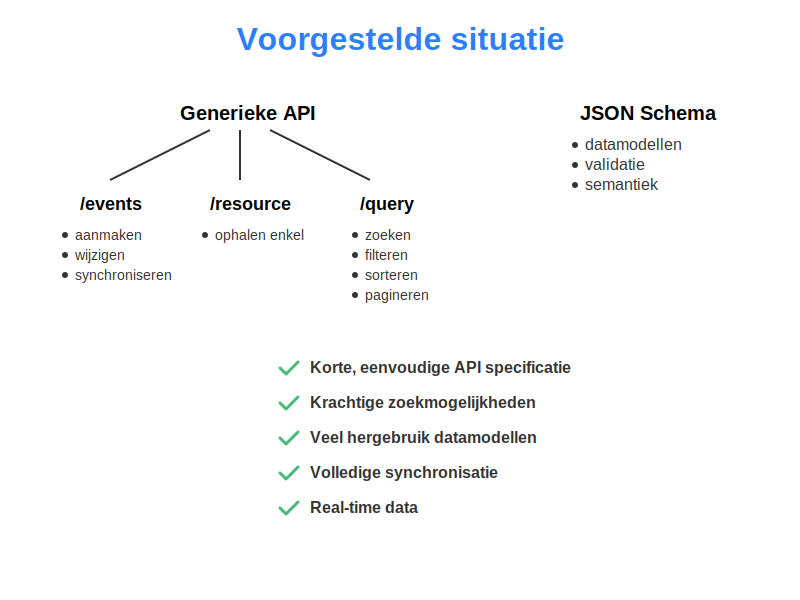

**Naar een generieke API strategie bij VNGR**

_Joep Meindertsma, 24 Maart 2026_

# Introductie

Dit document omschrijft mijn persoonlijke visie op hoe we binnen de VNG een uniforme API strategie kunnen hanteren. Dit is niet per se de mening van mijn collega's, of van VNG in het algemeen, maar ik vind het belangrijk om in ieder geval vanuit mijn bril een visie te delen over waar we naartoe zouden kunnen bewegen.

VNG levert en beheert enkele belangrijke standaarden. Ik denk dat we meer kunnen doen om onze standaarden compacter, sneller, en bovenal simpeler te maken.

- Wat is de **huidige situatie**, en wat zijn de problemen daarmee
- Wat is de **gewenste situatie**, wat zou dit oplossen
- Wat zijn de **openstaande vragen** voor deze richting

# Huidige situatie

## Per applicatie / domein een eigen API

Nu krijgen specifieke domeinen (zoals Zaken, Gesprekken, Raadsinformatie, etc) allemaal een eigen API. Dit is een begrijpelijke keuze, want zo werkt data hergebruik in de meeste situaties: iedere dienst heeft een eigen API. Dit paradigma functioneert, maar heeft tekortkomingen als de schaal en complexiteit erg groot worden:

- **Hergebruik datamodellen is beperkt.** Sommige datamodellen (zoals Persoon, of Document) komen terug in diverse applicaties. Het is dan verspilling van tijd om per applicatie opnieuw discussie te voeren over welke velden er in moeten, en hoe ze moeten heten. Maar dit soort discussies krijgen we nu wel (zoals ik laatst zag in een MijnGesprekken meeting). Dit is te voorkomen met herbruikbare datamodellen. Helaas gaat dit herbruiken van datamodellen erg lastig als je ze koppelt aan de OpenAPISpec.
- **Inconsistentie van patronen.** Per API worden er andere keuzes gemaakt over zaken als filtering, querying, paginering, response codes en meer. Dat betekent effectief dat het wiel heel veel keren opnieuw wordt uitgevonden, waardoor er per API andere code moet worden geschreven. Dat levert werk op aan zowel de kant van de producer (leverancier) als consumer (hergebruiker).
- **Geen gestandaardiseerd protocol**. De API’s worden weliswaar uitgedrukt in een machineleesbaar formaat (OpenAPI spec), maar alsnog is het protocol zelf niet gestandaardiseerd. Als ontwikkelaar zou je dus per API weer moeten werken om alles opnieuw in te bouwen

## Per datamodel een eigen endpoint

Binnen een API specificatie krijgt ieder model (bijv. Document, Taak, Zaak) een eigen endpoint (/taken). Hier is het schrijven (command, POST) en het uitlezen (query, GET) sterk aan elkaar gekoppeld en uitgewerkt per datamodel. Wederom begrijpelijk, maar bij grotere en meer complexe systemen is dit niet meer optimaal:

- **Complexe API specs**. Met ieder extra datamodel groeit je specificatie. Ik heb VNG OpenAPI specs gezien van _duizenden_ regels groot. Dit is voor leveranciers een gigantische klus om te implementeren. Dat **vertraagt adoptie** van je standaard, en maakt daarmee het hele project duurder en langer. Dit lijkt me op zichzelf al genoeg reden om deze aanpak in twijfel te trekken.
- **Versiebeheer ingewikkeld.** Als je datamodellen aan je versiebeheer van je API / Endpoint zijn gekoppeld, wordt het lastig om nieuwe datamodellen te delen. Dat betekent een versie bump voor beiden. Wanneer een Producer (die op v1.2 draait) een datamodel wil aanleveren aan een Consumer (die op v1.1 draait), maar de Consumer dit datamodel nog niet heeft, dan loopt het geheel stuk. De Consumer _kan_ deze data niet krijgen. Er ontstaan gaten in de data. De oplossing voor dit probleem: trek datamodel en API los van elkaar.

## Informatiemodellen en datamodellen als losse concepten

Op dit moment worden informatiemodellen ontworpen in UML, mermaid, of andere tooling. Met tools als Imvertor worden API's (OpenAPISpec bestanden) soms zelfs gegenereerd uit deze modellen. Het hebben van heldere en passende datamodellen is essentieel en ik zie daar absoluut de noodzaak van in. Maar wanneer de informatiemodellen los staan van de datamodellen (in de API) spec, kan dit tot problemen leiden:

- **Datamodellen zijn niet herbruikbaar**. De informatie model bestanden zijn slechts zeer beperkt machine leesbaar / converteerbaar. Mogelijk zijn ze niet eens opvraagbaar over het web op gestandaardiseerde wijze. Dit beperkt in hoevere anderen ze kunnen gebruiken.
- **Verschil tussen datamodel en informatiemodel leidt tot verwarring.** Als informatiemodel en datamodel aparte concepten zijn, gaan daar verschillen tussen ontstaan. Dat maakt het voor hergebruikers ingewikkelder om te begrijpen en kan leiden tot onnodige verwarring.
- **Leidt tot onpraktische modellen.** Een model is nooit een neutrale beschrijving van de werkelijkheid - het is altijd een specifieke invulling die met een bepaalde bril logisch lijkt. Welke bril kies je dan? In mijn optiek, moet dat de bril zijn van degene die de data _moet gaan gebruiken_, en dat is in dit geval vooral de applicatiebouwer. De functionele eisen moeten bepalen in welke vorm je data staat. Als deze wensen _niet_ in het informatiemodel worden meegenomen, kan het informatiemodel beperkend en problematisch zijn wanneer de applicatie gaat worden gebouwd.

## Geen synchronisatie mogelijkheden in huidige API's

De bestaande REST APIs hebben geen mogelijkheden om betrouwbaar en eenvoudig (alle) gegevens van een producer naar een consumer te krijgen. Dat heeft enkele problemen:

- **Fouten en gaten in data.** Per object moet er een POST worden gemaakt, naar een specifiek endpoint, waar vervolgens om allerlei redenen fouten kunnen ontstaan (netwerk fouten, data fouten). Als deze fouten voorkomen, is het de verantwoordelijkheid van de Producer om het later nog eens te proberen. Dit betekent dat de Producer een lijst moet bijhouden van items die er mis zijn gegaan, of dat hij bij moet houden welke informatie de Consumer heeft. Dat is een gigantisch complexe en foutgevoelige taak. En deze verantwoordelijkheid leggen we effectief bij iedere leverancier - een onredelijk grote taak, waar ze waarschijnlijk ofwel fouten in gaan maken (wat leidt tot dataverlies) ofwel überhaupt niet willen inbouwen (waardoor adoptie laag is en de standaard niet wordt gebruikt)
- **Vendor lock-in / lage dataportabiliteit**. Data van systeem A naar B krijgen kan soms zeer kostbaar zijn. Leveranciers werken soms actief tegen, of vragen veel te veel geld als data moet worden overgezet. 
- **Geen betrouwbaar verwijderen mogelijk.** Soms worden per ongeluk items gepubliceerd met persoonsgegevens er in. Ik ben dit helaas vaak tegengekomen bij Open Raadsinformatie (fouten in anonimisatie / lak software, slordige griffie medewerkers). We hebben geen automatische manier om dit soort fouten te herstellen. Als een medewerker braaf de data publiceert uit een bronsysteem, is dat geen garantie dat dit ook wordt verwijderd bij de Consumer.
- **Geen realtime applicaties.** In veel domeinen is real-time geen eis, maar in bijvoorbeeld een chat applicatie (zoals MijnGesprekken) is dat wel het geval. Real-time kan zeer lastig zijn en veel complexiteit met zich mee brengen. Als je dit niet vroeg (en generiek genoeg) oplost, gaat het veel geld kosten en wederom adoptie vertragen.

## Geen granulaire authorizatie in APIs

Wie mag wat? Hoe voorkom je dat gevoelige gegevens op straat komen te liggen?
Op dit moment gebruiken de grootste API's binnen VNG (bijvoorbeel ZGW 1.6) applicatie authorizatie.
Dat houdt in dat iedere applicatie volledig verantwoordelijk is om alle authorizatie zelf af te handelen.
Met andere woorden: alle apps mogen overal bij, en moeten zelf er voor zorgen dat de data niet lekt.
Dat is een flinke eis, en maakt het gevaarlijk om een systeem toegang te geven.
Een enkele fout in 1 van de vele applicaties, en gevoelige gegevens kunnen op straat komen te liggen.

## Beperkte schrijf mogelijkheden in APIs

- **Geen batched transactions.** Sommige APIs, zoals de ZGW API, vereisen soms dat er onnodig veel transacties moeten worden gedaan voor dingen die als een enkele zouden moeten voelen. Als een zaak moet worden afgesloten, moeten er soms wel in 4 verschillende resources velden worden gewijzigd. Daar kan veel fout gaan. Dat betekent nu dat leveranciers allemaal complexe logica in hun client applicaties bouwen om sequentieel resources aan te maken.
- **Geen auditing / versioning.** Doordat we niet opslaan welke transacties er gebeurt zijn, kunnen we lastig achterhalen wie wat wanneer heeft gewijzigd.

## Beperkte query mogelijkheden in APIs

Doordat we per model (zoals Zaak, Document, etc) een endpoint ontwerpen, kunnen er per model andere query mogelijkheden zijn. Dit brengt niet alleen veel complexiteit met zich mee (wat adoptie vertraagt), maar is ook inherent beperkend voor hergebruikers - het zegt namelijk dat er ook veel query mogelijkheden _niet_ beschikbaar zijn.

Als hergebruiker (bijvoorbeeld als bouwer van de MijnZaken app) heb je soms zeer specifieke zoek (query)wensen. Misschien wil je alle zaken hebben van een bepaalde gebruiker (een filter op een veld), en misschien wil je die wel sorteren op datum (een sort attribuut), of misschien wil je wel alleen de zaken van die gebruiker zien waarbij de status op “open” staat. Misschien wil je ook wel laten zien _hoeveel_ documenten er dan beschikbaar zijn. 

Nu lossen we dit soort problemen op door per endpoint, per datamodel, heel veel discussie te voeren en heel veel attributen toe te voegen. Daardoor wordt je API specificatie zeer groot (wat nu het geval is), waardoor implementatie (en dus adoptie) stroef loopt en foutgevoelig is. En tenslotte ga je usecases over het hoofd zien, waardoor je toch altijd achter loopt - en dus beperkte query mogelijkheden houdt.

Zo zijn er nu in de APIs nog geen manieren om full-text-search te doen - een functionaliteit die in veel usecases zeer waardevol is. 

# Voorgestelde situatie

## VNG Datamodellen beschikbaar stellen via JSON-Schema

In plaats van je informatiemodellen om te zetten naar een OpenAPI specificatie, zetten we bestaande modellen om naar [JSON Schema](https://json-schema.org/). Dit zijn JSON objecten die beschrijven welke vorm je data moet hebben. Dit is naar mijn mening de juiste standaard om hiervoor te kiezen:

- **OAS Compatible.** Deze standaard kan eveneens gewoon gebruikt worden in OpenAPI documenten.
- **Veel libraries beschikbaar.** Voor de meeste programmeertalen zijn hoogwaardige JSON Schema implementaties te vinden. Dit maakt het goedkoop om te adopteren.
- **JSON is de standaard.** Omdat praktisch alle moderne applicaties al werken met JSON, is dit gewoon precies wat ontwikkelaars verwachten.

Ik stel voor dat we 1 Github respository krijgen voor JSON Schema datamodellen. In deze repository is altijd de laatste versie te vinden van alle datamodellen. We zetten vervolgens deze JSON Schema bestanden beschikbaar in een simpele, doeltreffende, gebruiksvriendelijke webinterface: VNG Datamodellen. Dit online beschikbaar stellen biedt andere belangrijke voordelen:

- **Geautomatiseerd testen**. Doordat met deze opzet de JSON Schema modellen als HTTP URL opvraagbaar zijn, kunnen leveranciers in hun ontwikkelstraat (CI/CD) per model testen of hun applicatie hieraan voldoet. Je kunt ook eenvoudig JSON Schema compatible fuzzing doen.
- **Gegenereerde formulieren**. Een JSON Schema document kan worden gebruikt om formulieren mee te bouwen die gegarandeerd voldoen aan de vorm van de data. Dit maakt het ontwikkelen van formulieren per model geheel gratis! Dit betekent dat leveranciers in hun applicaties aan hun gebruikers direct VNG-specifieke datamodellen kunnen presenteren, zodat data veel beter gestandaardiseerd en dus herbruikbaar zal zijn. 

Doordat we de datamodellen zien als _losstaand van de API_, kunnen discussies over welke velden welke namen krijgen, welke velden verplicht zijn etc. ook los worden gekoppeld van hoe de API zelf functioneert.

## Generieke APIs, 3 endpoints

In plaats van dat we per domein een eigen API hebben, en per datamodel een eigen endpoint, hebben we een enkele API die alle functionaliteiten op generieke, standaard wijze aanbiedt. We gebruiken bestaande standaarden waar mogelijk, en volgen industry best practices. Doordat we JSON-Schema gebruiken voor de datamodellen, hoeven we niet meer model-specifieke informatie te stoppen in onze API modellen.

De exacte vorm van deze generieke API is een belangrijke discussie. Over de invulling heb ik wel al gedachten. Mijn opzet is als volgt:

- **Event Endpoint.** We doen _Event Sourcing,_ middels de CloudEvents standaard. Producers (leveranciers) maken “events” aan, waarin wijzigingen en gebeurtenissen beschreven staan. Deze worden opgeslagen en kunnen worden herbruikt. Consumers (zoals de MijnServices) kunnen deze CloudEvents ophalen bij de bron. Deze CloudEvents beschrijven _veranderingen_ in data. Dankzij dit paradigma is het mogelijk om systemen foutloos in sync te houden, real-time updates over de lijn te sturen, en dit alles te realiseren op een manier die veel minder tijd en geld kost dan diverse endpoints te onderhouden.
- **Resource Endpoint.** De huidige staat van iedere resource is individueel opvraagbaar bij de bron, middels een URL, als JSON object. De vormen van deze resources voldoen aan de JSON Schemas die ik hierboven heb beschreven.
- **Query Endpoint.** Een enkele ElasticSearch-compatible zoekinterface met krachtige query mogelijkheden. Dit biedt de mogelijkheid om simpele vragen te beantwoorden zoals: “geef me alle documenten”, maar ook complexe, zoals “geef me alle documenten van pieter, gesorteerd op datum, waar de bestandsgrootte meer dan 1MB is”. Dit is het type zoektechnologie wat ook gebruikt wordt in webwinkels, of platforms zoals [OpenBesluitvorming](https://openbesluitvorming.nl/).
- **Domain Endpoints**. Domein specifieke APIs die een bepaalde selectie doen op de Query endpoint. Effectief zijn dit een soort “query templates”, een stukje data die niet hoeft te worden geïmplementeerd door een leverancier. Ze brengen dus geen extra werk mee voor leveranciers. Deze kunnen specifieke filters bevatten om te voorkomen dat privacy gevoelige informatie lekt. Deze kunnen gebruikt worden

## Authenticatie: simpel & gestandaardiseerd

Hier kan ik lekker kort over zijn, want praktisch de hele wereld doet exact hetzelfde: OAuth + [OIDC-NLGOV](https://github.com/Logius-standaarden/OIDC-NLGOV/) + .
Als gebruiker wil je kunnen inloggen met je bestaande accounts.

## Authorization: snel & veilig

Ik stel voor dat we werken met **ABAC**, ofwel Attribute Based Access Control.
Dit houdt in dat we op basis van attributen in de data bepalen wie er toegang krijgt.
Het grote voordeel hiervan, is dat we _query time_ in staat zijn om leesrechten te bepalen.
Dan kunnen we aan een database vragen "geef me alle relevante zaken", en de database past vervolgens een filter toe in de zoekopdracht op basis van de ABAC regels (bijvoorbeeld, "alleen zaken waarbij `betrokkene={gebruiker}`").
Hierdoor kan er _snel_ een antwoord komen, en blijft de applicatie prettig in gebruik.
