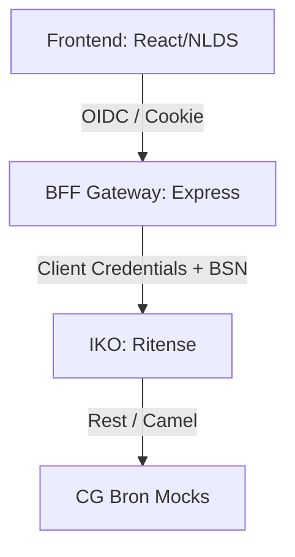
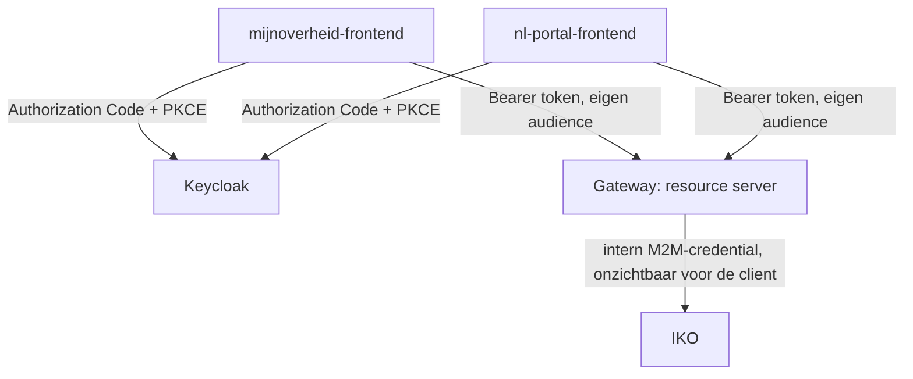

# Architectuur Burgerportaal IKO

Dit document beschrijft de implementatie en architectuur van het burgerportaal op IKO.

## Overzicht
Het burgerportaal is opgebouwd volgens het patroon uit de referentie-architectuur:
`Frontend (browser) --> BFF-gateway --> IKO (Aggregatielaag) --> Bronnen (Mocks)`

## Componenten
1. **Frontend**: React-applicatie gebaseerd op de MijnOverheid-demo (NLDS/Ark UI).
2. **BFF Gateway**: Express server die inloggen via Keycloak (DigiD-simulatie) afhandelt, de BSN uit het token haalt en hiermee IKO Aggregated Data Profiles (ADP) aanroept.
3. **IKO (Integraal Klant- en Objectbeeld)**: Aggregeert data uit verschillende Common Ground-bronnen (zaken, taken, plannen, etc.).
4. **Mocks**: De Common Ground API mocks van het VNG API Lab.

## VNG-mock-compatibele facade

Naast de eigen `/api/portaal/*`-endpoints biedt de gateway een facade die
exact dezelfde paden en response-vormen serveert als de VNG API Lab-mocks,
gevoed door de IKO ADP's. Hierdoor kan de **ongewijzigde** MijnOverheid-app
(`mijnoverheid/` in vng-api-lab) via haar per-API endpoint-overrides op de
gateway wijzen en loopt al het dataverkeer via IKO in plaats van rechtstreeks
naar de mocks.

Zet in de API-inspector van de MijnOverheid-app per API de override op:

| API | Override |
|---|---|
| MijnTaken | `http://localhost:3000/apis/rest/taken/next` |
| MijnZaken | `http://localhost:3000/apis/rest/zaken/next` |
| MijnProducten | `http://localhost:3000/apis/rest/producten/next` |
| MijnAgenda | `http://localhost:3000/apis/rest/agenda/next` |
| MijnGesprekken | `http://localhost:3000/apis/rest/gesprekken/next` |
| MijnPlan | `http://localhost:3000/apis/rest/openplan-plannen/next` |
| MijnGegevens | `http://localhost:3000/apis/rest/openklant-klantinteracties/mijnoverheid-demo` |

De MijnOverheid-demo kent geen DigiD-flow; zonder ingelogde sessie valt de
facade terug op de demo-BSN (`MOCK_BSN`). De `plan`-ADP aggregeert plan +
doelen in één object; de facade splitst dat weer naar de twee
lijst-resources (`/plan` en `/doel`) die de mock-API aanbiedt.

### Connectoren
Het seed-script maakt twee connectoren aan:
- **generic-rest**: kale REST-passthrough (niet meer in gebruik, ter referentie).
- **token-rest**: zet een statische `Authorization`-header uit de
  instance-config (de VNG-mocks vereisen `Bearer dummy-token`; Open Klant een
  eigen TokenAuth), zet `Content-Type`/`Accept` op JSON en bouwt de
  request-body uit het endpoint-transform-resultaat (IKO zelf bindt dat
  resultaat alleen aan headers/parameters, waardoor POST-operaties anders een
  lege body krijgen).

## Federated-auth resource-server-routes (`/api/federated/*`)

Naast de sessie/BFF-flow hierboven bevat de gateway een **principieel
ander** auth-model, dat het pattern uit
[`../../patterns/federated-auth/next.yaml`](../../patterns/federated-auth/next.yaml)
toepast (zie `gateway/federated-auth.js`). Waar de BFF-flow de burger nooit
zelf een token laat zien (alles loopt via een sessiecookie, en de gateway
praat met IKO via één gedeeld M2M-servicecredential dat voor élke ADP werkt),
is dit een echte **OAuth2 resource-server**: geen sessie, geen cookie, en
geen client-supplied identiteit — de gateway verifieert zelf een binnenkomend
Bearer-token (JWKS, issuer, audience) en leidt de burger-BSN uitsluitend af
uit de geverifieerde token-claim.

**Wat dit concreet oplevert** (live geverifieerd, zie
`burgerportaal-iko/federated-test.sh`):
1. Twee onafhankelijk geregistreerde clients (`mijnoverheid-frontend`,
   `nl-portal-frontend` in `deploy/keycloak/realm.json`) — twee verschillende
   "plekken" — halen elk hun eigen token op via een echte Authorization Code
   + PKCE-flow (publieke clients, geen client secret).
2. Beide tokens zijn audience-restricted naar `iko-federated-gateway` (via
   een Keycloak audience-mapper — het praktische equivalent van RFC 8707,
   niet de letterlijke resource-indicator-wire-syntax) en dragen een
   `bsn`-claim.
3. `GET /api/federated/gegevens` accepteert **geen** client-supplied
   identiteit — de BSN komt uitsluitend uit het geverifieerde token, dus is
   dit endpoint safe by construction.
4. `GET /api/federated/debug/gegevens-als/:bsn` bestaat uitsluitend om
   record-level enforcement aantoonbaar te maken: een geldig token voor
   burger A, gebruikt om de BSN van burger B op te vragen, levert de
   gestandaardiseerde `403 RecordNietGemachtigd`-response op (uit het
   pattern-bestand) — niet omdat er toevallig geen ingang voor is, maar
   omdat de vergelijking actief afdwingt.

### Discovery: `GET /.well-known/federated-resources`

Los van authenticatie ontbrak nog een stuk: hóe weet een client welk
systeem "Mijn taken" bedient versus "Mijn zaken" versus "Mijn producten"?
Dat lost het discovery-manifest op
(spec: [`../../apis/rest/discovery/next.yaml`](../../apis/rest/discovery/next.yaml),
schema: [`../../schemas/discovery/v0.0.1.json`](../../schemas/discovery/v0.0.1.json)) —
publiek, onbeveiligd (vergelijkbaar met OAuth's eigen
`.well-known/oauth-authorization-server`, RFC 8414: identiteitsagnostische
deploymentconfiguratie, hetzelfde antwoord voor iedereen), en bewust **geen**
OpenAPI-document (dat beschrijft één API, niet een register van meerdere) —
in plaats daarvan linkt elke entry naar de al bestaande, canonieke OAS-spec
van die bron (`specUrl`) in plaats van operaties te dupliceren.

**Belangrijke correctie t.o.v. een eerdere versie van dit document**: het
manifest is géén per-burger-gepersonaliseerde lijst en hoort dat ook niet
te zijn — `.well-known` belooft per conventie hetzelfde antwoord voor
iedereen. De sleutel is niet "wie vraagt er" maar **`service`** (heette
eerder `domain` — hernoemd omdat "domain" verwarring gaf met een
DNS-hostnaam, terwijl `baseUrl` al de echte host draagt; dit is service
discovery, geen domeinregistratie): elke entry beschrijft welke service
door welk systeem (`baseUrl`) wordt bediend.

**Tweede correctie**: het schema is inmiddels teruggebracht tot een
minimaal, generiek kerncontract — alleen `service`, `baseUrl`, `specUrl`
en optioneel `label`. Velden als `authMode`/`audience`/`mockToken`/`scopes`
uit eerdere versies waren te veel gemodelleerd naar dít ene project (IKO's
eigen OAuth-opzet, de lab-mocks' testtoken); hoe te authenticeren staat al
canoniek in de `securitySchemes` van de spec achter `specUrl`, dus dat
hoort het manifest niet te dupliceren. Het schema verbiedt geen extra
velden, dus een deployment mag zelf uitbreiden: IKO's eigen manifest bevat
bijvoorbeeld nog een `audience`-veld (want een standaard OAS-securityScheme
kent geen audience-concept) — expliciet gedocumenteerd in
`gateway/federated-auth.js` als IKO-eigen extensie, geen onderdeel van het
generieke contract. Vandaag delen alle drie IKO-services toevallig dezelfde
`baseUrl`/`audience` (IKO bedient ze alledrie), maar dat is een eigenschap
van déze deployment, geen aanname in het manifest-format — zou `zaken`
morgen door een apart Zaaksysteem-A bediend worden (met een eigen
audience, zoals in de oorspronkelijke NL Portal/Zaaksysteem-A-vs-Open-
Klant-casus), dan verandert alleen die ene entry. Wat een burger
*daadwerkelijk* heeft (open taken of niet) blijft volledig de
verantwoordelijkheid van de resource zelf (lege lijst als er niets is) —
het manifest zegt alleen welk systeem je moet bellen, nooit wat je daar
zult aantreffen.

`federated-test.sh` gebruikt dit nu ook echt: stap 0 haalt het manifest op
en zoekt per service (`manifest_field taken baseUrl`, `manifest_field
producten baseUrl`, ...) het juiste systeem op — geen enkele URL is nog
hardcoded — en verifieert na het inloggen dat de `aud`-claim in het
ontvangen token overeenkomt met het (IKO-eigen extra) `audience`-veld dat
het manifest voor die service beloofde. Stappen 5 en 6 bevragen `taken`
resp. `producten` via hun eigen opzoeking, en tonen daadwerkelijke
mockdata (waaronder een `Parkeervergunning bewoners`). **Eerlijke grens**:
de audience wordt nog
statisch per Keycloak-client afgedwongen (de audience-mapper in
`realm.json`), niet dynamisch via een RFC 8693 token-exchange
`resource=<audience-uit-manifest>`-aanvraag — dat laatste zou de logische
vervolgstap zijn richting een client die zelf bepaalt welke bronnen hij
aanspreekt puur op basis van het manifest, zonder dat elke bron vooraf als
aparte Keycloak-client-audience hoeft te zijn ingericht.

**Nog niet gedekt** (zie ook de "Wat dit pattern NIET kan vastleggen"-sectie
in het pattern-bestand zelf): DPoP/sender-constrained tokens (vereist dat de
browser zelf een sleutelpaar genereert en elk verzoek ondertekent — echte
frontend-JS, niet te demonstreren met een curl-script), toegangslogging bij
de bron, en dynamische token-exchange (zie hierboven).

IKO's eigen M2M-koppeling (`getIkoServiceToken`, het gedeelde client-
credentials-secret) blijft intern bestaan — de externe client weet er niets
van. Dat is precies het punt: IKO's *aggregatielogica* (zaak+doelen
samenvoegen, meerdere registers bevragen) blijft nuttig, maar de
*authenticatiegrens* naar buiten toe gedraagt zich nu als een normale
federated-auth-resource-server in plaats van één opaak app-credential.
